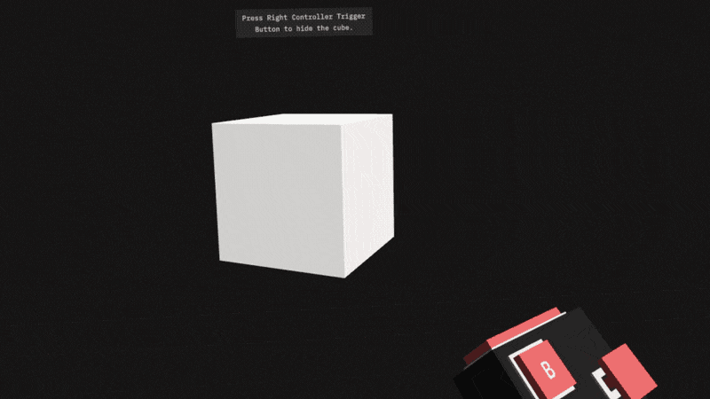

# XR Emitter
Events emitter is a wrapper over Unity's XR Interaction Toolkit that provides an easy-to-use way to interact with XR events.

Right now, XREmitter helps to get events from hand controllers ([a list of the events](#events-list)).


# How to set up it
Assume that you already set up XR Toolkit and added XR Rig to your scene.

1. Import `XREmitter.unityasset` into your project;

2. Add `XREmitterR` and/or `XREmitterL` component to Right/Left Controller in your scene;

3. Assign XRControllers to the components accordingly;

4. Subscribe your method to an event stream.

# How to use it
Here is a simple example of how the `XREmitter` can be used. 

Note, XREmitter's events are static, so you don't need to have a reference to an object.

*(Look at the `XR Emmiter Demo/Assets/Scenes/Demo 2.unity` to see the example in action.)*

```csharp
using UnityEngine;

public class CubeManager : MonoBehaviour
{
    [SerializeField] private GameObject cube;
    private bool _lastTriggerButtonState = true;
    
    // Subscribe a method to an event stream
    private void OnEnable() 
    {
        XREmitterR.OnTriggerButtonPressed += SetBoxVisability;
    }

    // A good practice to unsubscribe a method when its object is gone
    private void OnDisable() 
    {
        XREmitterR.OnTriggerButtonPressed -= SetBoxVisability;
    }

    // The signature of the method the same as the event stream we want to subscribe to.
    private void SetBoxVisability (bool b) 
    {
        if (_lastTriggerButtonState == b) return;
        _lastTriggerButtonState = b;

        cube.gameObject.SetActive(!b);
    }
}
```


# Events List
` <T> ` defines a data type that is going to be passed to a subscribed method.
```csharp
public static event Action<float>   OnTriggerIntensity;
public static event Action<bool>    OnTriggerButtonPressed;
public static event Action<bool>    OnPrimaryButtonPressed;
public static event Action<bool>    OnPrimaryButtonTouched;
public static event Action<bool>    OnSecondaryButtonPressed;
public static event Action<bool>    OnSecondaryButtonTouched;
public static event Action<float>   OnGripIntensity;
public static event Action<bool>    OnGripPressed;
public static event Action<Vector2> OnPrimary2DAxis;
public static event Action<bool>    OnPrimary2DAxisPressed;
public static event Action<bool>    OnPrimary2DAxisTouched;
```

# Contact
[Portfolio](https://olegfrolov.design/) | [Linkedin](https://www.linkedin.com/in/oleg-frolov-6a6a4752/) | [Dribbble](https://dribbble.com/Volorf) | [Twitter](https://www.twitter.com/volorf)